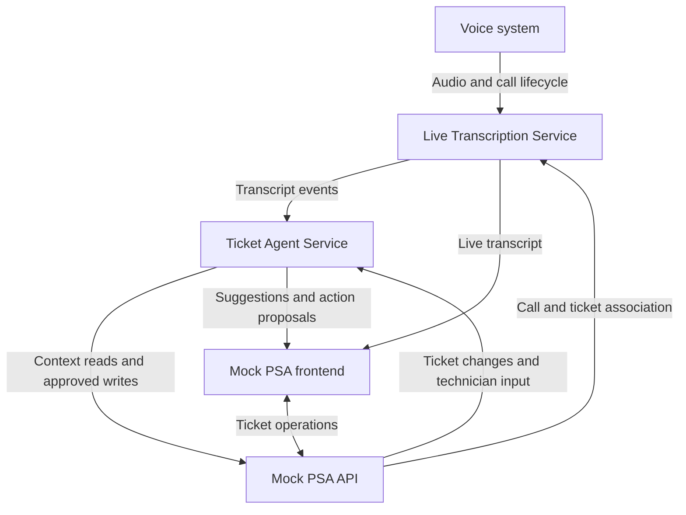

# Project DeskSide

Real-time AI assistance for service-desk calls and tickets

## Purpose of this document

Use this brief to initialize a AI-assisted coding sessions for this project. It records the product intent, architecture discussion, proposed scope, and unresolved choices. It is not a claim that any component has already been implemented.

Before making changes, inspect the actual repository, its instructions, dependencies, and existing code. Treat the user's current instructions and established repository decisions as authoritative. Distinguish confirmed requirements below from proposed implementation defaults; do not silently turn suggestions into fixed requirements.

## Product and motivation

Build a portfolio-quality AI assistant that helps an MSP technician work a support ticket during a live customer call. The technician works inside a mock professional services automation (PSA) application. The system transcribes the call, surfaces customer context and relevant evidence, updates troubleshooting guidance as new facts emerge, and prepares ticket documentation and actions for review.

The project should demonstrate practical engineering across real-time event processing, retrieval, tool-using agents, application integration, evaluation, and human approval of changes.

The developer is an experienced Python and AI/data engineering leader with prior ConnectWise/MSP experience. They understand the domain and distributed systems, and want to demonstrate current hands-on agentic engineering experience. Explanations should focus on architectural tradeoffs and unfamiliar agent/voice concepts.

The original feasibility constraint is approximately four weeks of full-time solo work. A credible, bounded demonstration is the objective; broad commercial product parity is outside that budget.

## Decision status

| Topic | Status |
| --- | --- |
| Product concept | User-established: real-time intelligence for technicians working tickets. |
| PSA integration | User-established: create a mock PSA API and frontend. |
| Service decomposition | User-proposed and discussed: PSA API, PSA frontend, live transcription, ticket agent. |
| Data stores | User abstracts relational storage, Redis, and similar infrastructure inside those service boundaries for the high-level discussion. |
| Agent lifecycle | Initial assistance, assistance updates during the conversation, and end-of-conversation assistance. Event-driven sessions are the recommended implementation. |
| Transcription destination | User leans toward notifying the Ticket Agent Service. This is the recommended logical route. Exact transport remains open. |
| Product name | Codename DeskSide (`deskside`) Do assume as an adopted permanent name or rename existing code. |
| Technology stack and deployment | Not finalized. Follow existing repository choices where present. |
| Implementation progress | Not verified in this planning conversation. Inspect the repository before proposing scaffolding or describing progress. |

## Product inspiration and evidence limits

The inspiration is Thread's MSP service-desk product, specifically its combination of Voice AI, Contact Intelligence, Proactive Suggestions, and Super Magic.

Public documentation reviewed during the planning conversation described:

- Voice capture, transcription, ticket updates, and call wrap-up.
- Contact memory extracted from resolved conversations and surfaced on later interactions.
- Proactive troubleshooting briefs grounded in ticket history and documentation.
- An in-ticket agent that uses operational tools and requests confirmation for interactive writes.

An important limitation: Thread's Proactive Suggestions documentation described one suggestion attempt per eligible ticket, triggered by ticket opening or triage handoff. The research did not establish a continuously regenerated troubleshooting plan after each utterance. Live-updating guidance is a proposed behavior of this project, not a verified claim of identical Thread functionality.

Thread's provider list identified LiveKit for Voice AI media infrastructure, Cartesia for speech synthesis, and Twilio for messaging/WebSocket transport. This is partial provider evidence, not a complete reconstruction of its architecture. This project does not need to reproduce its stack.

## Target user experience

1. A technician opens an existing ticket with an associated customer, contact, and device.
2. The technician starts or joins a support call from the ticket.
3. The assistant loads the ticket and relevant history and presents an initial briefing while the call connects.
4. Speaker-attributed transcript text appears during the conversation.
5. The assistant identifies important new facts, retrieves supporting records, and presents a small number of useful next steps or questions with sources.
6. The technician can ask the assistant a question, reject a suggestion, or report that a step was already attempted.
7. The assistant adjusts its guidance when evidence changes. For example, learning that an entire office is affected changes the investigation from an individual device issue to a shared service problem.
8. The assistant proposes ticket changes and documentation. The technician reviews and approves them before the PSA API applies them.
9. At call completion, the assistant drafts a summary, attempted steps, resolution or escalation, and time entry.
10. Confirmed resolution facts can inform a future ticket.

For the first version, the human technician speaks to the customer; the AI primarily produces visual assistance. An AI voice attendant is a separate expansion.

## Four logical services

| Service | Responsibilities and ownership |
| --- | --- |
| Mock PSA API | Own tickets, customers, contacts, device associations, notes, and time entries. Expose historical context and validate mutations. Associate calls with tickets. Remain the system of record for ticket changes. |
| Mock PSA frontend | Provide ticket list/detail, call controls, transcript, context, suggestions, assistant interaction, and action review. Display actual persisted results after writes. |
| Live Transcription Service | Consume call audio, manage transcription lifecycle, and emit timestamped, speaker-attributed partial and final transcript events. Expose transcription completion or failure. |
| Ticket Agent Service | Maintain troubleshooting session state, retrieve context, use tools, decide when guidance should change, publish suggestions, manage proposed actions, and produce wrap-up. |

These are logical responsibilities. They do not require separate repositories or separate databases, and infrastructure details should not drive premature service proliferation.

Arrows show logical information flow, not a finalized network topology. A backend gateway can multiplex frontend updates over one connection. The browser need not connect directly to every backend. The voice provider's webhook and media-stream mechanisms are also separate implementation details to resolve.

## Agent lifecycle and event handling

### Initialization

Establish a call/session-to-ticket association before processing conversation content. Load the ticket, contact, environment, and relevant prior records. Produce initial assistance without waiting for the first transcript event.

### Active assistance

Use a long-lived logical session driven by events, not an LLM continuously running or repeatedly polling the transcript.

- Stream partial transcription to the UI for responsiveness.
- Use finalized segments and meaningful context changes to trigger analysis.
- Separate updating session state from deciding to generate a recommendation.
- Track known facts, uncertain hypotheses, attempted steps, outcomes, and supporting sources.
- Allow technician questions, feedback, and ticket changes to trigger work alongside transcript events.
- Coalesce updates while reasoning is in progress; prevent overlapping runs from publishing contradictory or stale results.
- Use timers only where useful, such as inactivity handling, bounded batching, or recovery timeouts.

The session can be implemented as an asynchronous worker initially. Its identity and recoverable state should not depend on one model request or one uninterrupted process lifetime.

### Completion

A call-ended event does not necessarily mean the last transcript segment has arrived. Await a transcription-complete signal or bounded drain timeout before final wrap-up. Identify incomplete capture when relevant. Keep drafts available for technician review after the call ends.

### Proposed event contract considerations

Exact schemas remain open. Useful fields include event ID, event type, session/call ID, ticket ID, client scope, timestamp, and sequence or revision. Transcript events also need segment identity, speaker identity, text, and partial/final status.

Handle repeated delivery and reconnects without duplicating segments or mutations. Associate suggestions with the context revision used to generate them. Decide explicitly where durable transcripts and session events live; avoid making an ephemeral delivery channel their only copy.

## Proposed MVP scope

These are recommended capabilities from the feasibility discussion, subject to the user's implementation priorities.

| Capability | Bounded implementation |
| --- | --- |
| Mock PSA | Persisted ticket list/detail, customer/contact/device context, priority, status, notes, and time entries. |
| Live audio and transcription | One customer and one technician in a browser audio session with speaker labels. |
| Context briefing | Relevant contact history, environment, previous incidents, and documentation. |
| Adaptive suggestions | A few cited next steps or questions; recognize contradictory facts and previously attempted steps. |
| On-demand investigation | A bounded tool-using agent querying mock PSA history, knowledge, and optionally simulated device status. |
| Approved actions | Propose notes and priority/status changes; execute through the PSA API after review. |
| Wrap-up | Draft summary, attempted steps, resolution/escalation, and time entry using measured call duration. |
| Lightweight memory | Retain confirmed resolution facts with provenance for later retrieval. |
| Replay and evaluation | Replay scenarios, inspect tool calls and evidence, and measure quality, latency, and cost. |

Suggested fixture scale: three fictional customers, 50–100 historical tickets, 15–25 knowledge articles, and three issue families such as VPN connectivity, Microsoft 365 access, and printing. Include outdated guidance, irrelevant near-matches, unresolved tickets, and conflicting information. These are suggested sizes, not acceptance gates.

Use synthetic operational data. Transcription, retrieval, agent decisions, approvals, and persistence should run end to end against that data. Clearly identify simulated device integrations and any replayed audio.

### Deferred capabilities

- Autonomous customer-facing voice conversations and full attendant behavior.
- Complex call transfers, telephony migration, and broad contact-center functionality.
- Real ConnectWise, Halo, Autotask, documentation-platform, or RMM integrations.
- Broad automated remediation or arbitrary device commands.
- Comprehensive administration, billing, enterprise SSO, and commercial-scale operations.
- Multi-agent orchestration unless a concrete requirement justifies it.

A real telephone number and a small MCP interface are potential extensions after the core workflow works.

## Proposed implementation defaults

Follow repository choices first. If the repository has no established stack, the discussion suggested Python for backend/agent work, React for the frontend, managed LiveKit for browser audio, streaming speech recognition, and relational storage with keyword/vector retrieval.

For visual assistance, a conventional text model with tool calling can consume transcription. Speech synthesis and a speech-to-speech model are not prerequisites. Provider, model, framework, package versions, event transport, database topology, and hosting remain open.

Start with one bounded tool-using agent and explicit application control over event scheduling, permissions, and persistence. Consider a thin MCP adapter when it demonstrates a useful integration boundary. Verify current SDK documentation before using APIs or commands; example code and remembered flags may be stale.

## Reliability and approval boundaries

- The agent proposes and coordinates; the PSA API validates and owns ticket mutations.
- An approval must bind to the actual proposed action and arguments. Enforce it on the backend rather than relying only on a UI button or model instruction.
- Validate the current ticket state before applying a proposal that may have become stale.
- Make retries safe for notes and time entries, and preserve an audit record of proposed and applied changes.
- Treat transcript and retrieved document content as evidence, not privileged instructions to expand tool permissions.
- Scope customer-specific retrieval and writes to the correct customer. Shared knowledge should be explicitly designated.
- Preserve sources and distinguish confirmed facts from hypotheses. Do not store a guessed fix as an established resolution.
- Keep ordinary ticket work available if transcription, retrieval, or the model fails.

These controls support the portfolio demonstration; full production hardening remains a separate effort.

## Evaluation and demonstration

Use held-out scenario variants plus a few actual audio recordings. Assess:

- Retrieval relevance and whether cited evidence actually supports guidance.
- Recognition of changed facts, failed steps, and contradictory history.
- Correct tool selection and arguments, approval enforcement, and duplicate-write prevention.
- Behavior when evidence is absent, another customer's record is a near-match, or a tool fails.
- Wrap-up faithfulness, including whether the issue was actually resolved.
- End-to-end suggestion latency measured from the relevant utterance ending, with median and p95 reported.
- Model/tool usage and cost per session under stated assumptions.

Do not claim performance results until measured. Evaluate more than the primary scripted happy path, and keep historical fixtures separate from held-out expected outcomes.

A strong demo: a VPN ticket initially suggests an individual-device cause; the caller reveals office-wide impact; the assistant revises the investigation with evidence, avoids repeating a failed step, proposes an escalation note, applies it after approval, and later retrieves the confirmed outcome for another ticket.

Deliver a usable application, repeatable demonstration, and concise engineering case study explaining architecture, decisions, evaluation results, known failures, and remaining production work.

## Proposed four-week sequence

| Week | Focus | Milestone |
| --- | --- | --- |
| 1 | Minimal PSA, fixture data, browser call, transcription | A real conversation appears in the correct ticket. |
| 2 | Retrieval, context briefing, tools, adaptive suggestions | New evidence produces useful, justified guidance. |
| 3 | Approved actions, wrap-up, lightweight memory, recovery | Complete a call through documented resolution or escalation. |
| 4 | Evaluation, fixes, UI polish, deployment, walkthrough | An interviewer can explore the demo with minimal setup. |

Planning estimate: 130–140 hours of scoped implementation with 20–30 hours of contingency in a 160-hour month. This is an estimate, not a delivery guarantee. Protect time for evaluation and presentation, and reduce integrations or secondary capabilities before sacrificing the core end-to-end demonstration.

## Open decisions and next-session orientation

Resolve choices incrementally when the next implementation slice needs them:

1. Existing repository layout and current implementation progress.
2. Final project name, if needed for new scaffolding.
3. Initial audio provider and whether to start with live browser audio plus replay support.
4. Backend/frontend frameworks and model/STT providers.
5. Event delivery, durable transcript ownership, session persistence, and frontend streaming route.
6. Knowledge storage and retrieval interfaces, including client scope.
7. Approval and tool execution contracts.
8. Local development and eventual demo hosting.

A useful first Codex task is to inspect the repository, report what already exists, and propose the smallest missing end-to-end slice. Avoid generating all four services or committing to a large framework solely because this brief lists their responsibilities. The user's current task determines what to implement next.

## Research references

These informed the earlier conversation; recheck them when current vendor behavior or APIs matter.

- [Thread Voice AI](https://www.getthread.com/voice-ai)
- [Thread Contact Intelligence](https://docs.getthread.com/ai-agents/contact-intelligence)
- [Thread Proactive Suggestions](https://docs.getthread.com/super-magic/proactive-suggestions)
- [Thread Super Magic](https://docs.getthread.com/super-magic/meet-super-magic-your-ai-assistant-in-the-inbox)
- [Thread provider list](https://docs.getthread.com/security-billing/list-of-sub-processors)
- [LiveKit multi-participant transcription example](https://github.com/livekit/agents/blob/main/examples/other/transcription/multi-user-transcriber.py)
